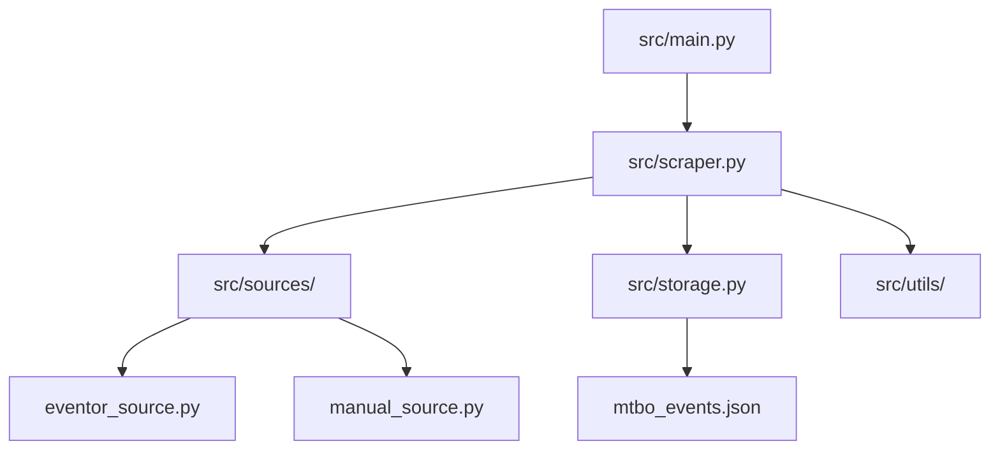

# AGENTS.md - Source of Truth

This file provides a high-level map of the `mtbo-scraper` repository to help AI agents understand the architecture and logic without crawling every file.

## 🏗️ Architecture Overview

The system is a Python-based scraper that fetches MTBO event data from multiple sources and aggregates them into a unified JSON format.

## 📂 Key Directories & Files

| Path | Purpose |
| :--- | :--- |
| `src/main.py` | CLI Entry point. Handles arguments and orchestrates the scrape. |
| `src/scraper.py` | Core `MTBOScraper` class. Manages source execution. |
| `src/models.py` | Pydantic models (Event, Race, Organizer) defining the data structure. |
| `src/sources/` | Source-specific implementations (Eventor, Manual). |
| `src/storage.py` | Handles reading/writing the `mtbo_events.json` state. |
| `src/exceptions.py` | Custom exception hierarchy for precise error handling. |
| `src/utils/` | Shared utilities (Date manipulation, Crypto, Diffs). |

## 🛠️ Design Patterns

- **Source Strategy**: Different sources (Eventor, Manual) inherit from `BaseSource`.
- **Validation**: Strict schema validation using `models.py` and `schema.json`.
- **State Management**: Incremental updates to `mtbo_events.json` to prevent data loss.

## 🚀 Common Commands

- **Scrape**: `./scrape_now.sh`
- **Test**: `./run_tests.sh`
- **Type Check**: `uv run mypy src/`
- **Lint**: `uv run ruff check .`

> [!TIP]
> Always verify the environment using `verify_env.py` before starting a long-running scrape or making architectural changes.
