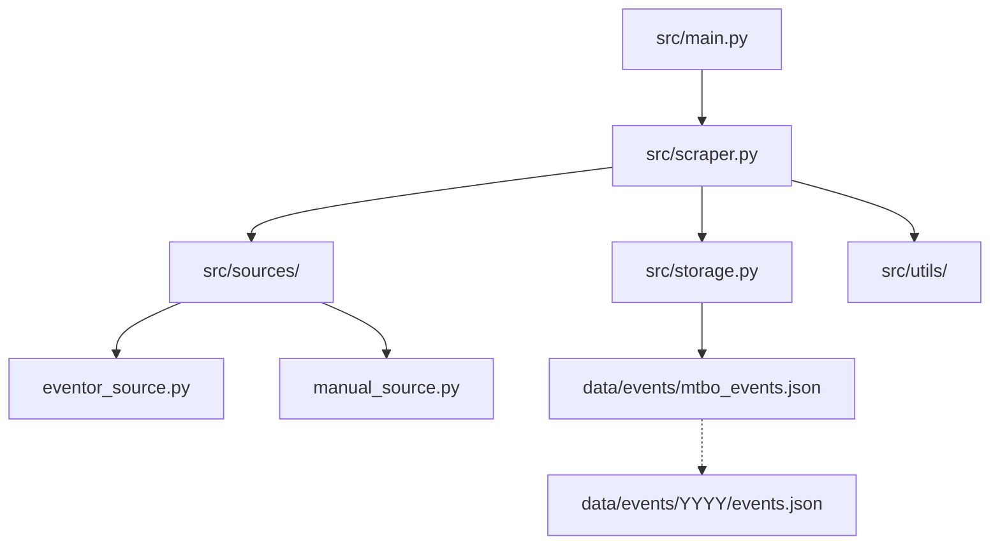

# AGENTS.md - Source of Truth & Coding Standards

This file is the **authoritative source of truth** for all AI agents working on the `mtbo-scraper` repository.

## 🚨 CRITICAL: Write Correct Code from the Start

Your primary goal is to write code that **passes all checks immediately**. Do not rely on "fixing it later."

### 1. Tooling & Environment
- **Project Scripts**: PREFER using the provided helper scripts (e.g., `./run_tests.sh`, `./scrape_now.sh`). These handle the environment automatically.
- **Dependency Management**: Use `uv` for managing packages (`uv add`, `uv sync`).
    - **NEVER** use `pip` directly.
    - **NEVER** modify `uv.lock` manually.

### 2. Test-Driven Development (TDD)
- **Requirement**: You must write tests **BEFORE** implementing new features or fixing bugs.
- **Offline First**: Tests **MUST NOT** make external network requests.
    - **Use Cached Data**: Use saved HTML examples in `tests/data/` or similar to mock responses.
    - **Mocking**: Mock all external calls (Eventor API, requests, etc.).
- **Speed**: Tests should run instantly using cached data.

### 3. Strict Coding Standards (Zero Tolerance)
Your code **WILL BE REJECTED** by pre-commit hooks if it fails these checks.

#### **Type Hints (MyPy Strict)**
- **Every function must have a return type**: `def foo() -> None:`
- **No `Any`**: Do not use `Any`. Define proper types or use protocols.
- **Generics**: Use standard collection generics (e.g., `list[str]`, `dict[str, int]`).
- **Validate**: `./run_tests.sh` or `uv run mypy src/`

#### **Linting & Formatting (Ruff)**
- **Line Length**: Max 88 chars.
- **Imports**: Sorted and grouped automatically.
- **Modern Python**: Use `pathlib` instead of `os.path`, f-strings instead of `%` formatting.
- **No Trailing Whitespace**: Avoid whitespace on empty lines (W293) or at the end of lines. Every blank line must be truly empty.
- **Validate**: `./run_tests.sh` or `uv run ruff check .`

#### **Documentation & Comments**
- **NO Internal Monologue**: Comments must describe **WHAT** the code does or **WHY** it exists (if complex).
    - ❌ `Bad`: `# I think I should loop here, maybe use enumerate?`
    - ❌ `Bad`: `# TODO: Check if this works` (unless legitimate tech debt)
    - ✅ `Good`: `# Rate limit prevents API ban (max 5 req/s)`
- **Docstrings**: Required for all public modules, classes, and functions.

### 4. Data Integrity & Read-Only Zones
- **READ-ONLY**: `data/` directory (including `mtbo_events.json`). These are generated by the scraper.
    - **NEVER** manually edit these files.
    - **NEVER** write code that manually patches these files.
- **Schema Sync**: If you modify `src/models.py`:
    1.  Update `schema.json`.
    2.  Update relevant **documentation** to reflect the schema change.

---

## 🏗️ Architecture Overview

The system is a Python-based scraper that fetches MTBO event data from multiple sources and aggregates them into a unified JSON format.

### 📂 Key Directories

| Path | Purpose | Rules |
| :--- | :--- | :--- |
| `src/main.py` | CLI Entry point. | |
| `src/scraper.py` | Core `MTBOScraper` class. | |
| `src/models.py` | Data models. | **Change requires schema & doc update.** |
| `src/sources/` | Source implementations. | |
| `src/storage.py` | I/O logic. | |
| `data/` | Scraped data storage. | **READ-ONLY for Agents.** |
| `tests/` | Unit and integration tests. | **Must use offline/cached data.** |

---

## 🚀 Common Commands

| Action | Command | Notes |
| :--- | :--- | :--- |
| **Verify Everything** | `./run_tests.sh` | **Run this after EVERY change.** |
| **Type Check** | `uv run mypy src/` | Must pass. |
| **Lint Check** | `uv run ruff check .` | Must pass. |
| **Scrape** | `./scrape_now.sh` | Can take args (e.g. source filters). |
