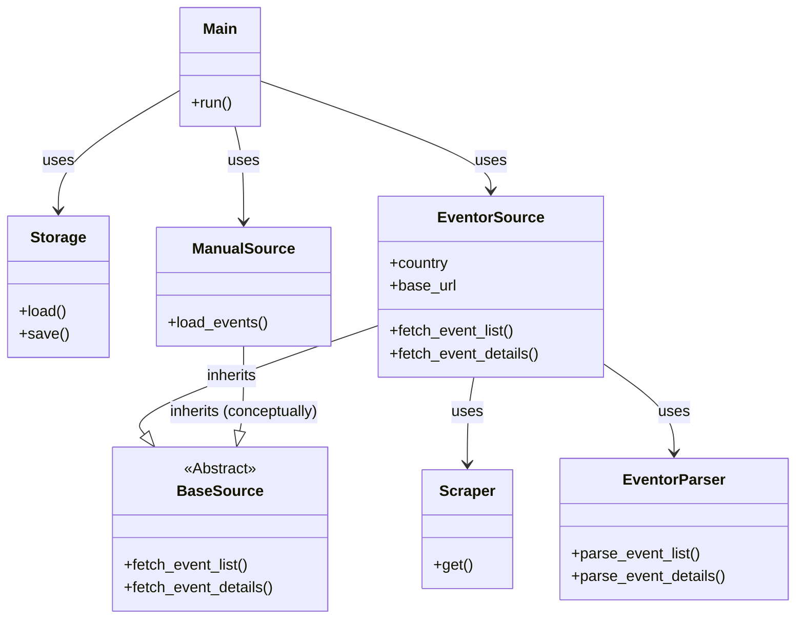

# MTBO Scraper Design Document

## Overview

The MTBO Scraper is a Python-based tool designed to collect Mountain Bike Orienteering event data from three Eventor instances:

- Sweden (https://eventor.orientering.se)
- Norway (https://eventor.orientering.no)
- IOF (https://eventor.orienteering.sport)
- Manual (Local filesystem events)

The scraper extracts event details, document links, entry statistics, and precise map locations (including embargoed area polygons) into a structured JSON format.

## Architecture

### Components

1.  **Scraper (`src.scraper.Scraper`)**:

    - Handles HTTP requests with automatic Cloudflare bypass.
    - **Primary**: Uses `curl-cffi` (impersonating Chrome 120) for most requests.
    - **Fallback**: Uses `undetected-chromedriver` for Cloudflare "managed challenges".
    - **Rate Limiting**: Configurable delay ranges (Default: 1-3s, History: 5-15s).
    - Caches browser cookies per domain for efficient subsequent requests.

2.  **Parser (`src.sources.eventor_parser.EventorParser`)**:

    - Parses HTML content using `BeautifulSoup` and `lxml`.
    - **List Parsing**: Extracts basic event info from the event list page.
    - **Detail Parsing**: Extracts detailed properties, document links, and statistics.
    - **Map Extraction**: Implements a specific recipe to extract map coordinates and polygons from the `input.options` JSON embedded in the page.

3.  **Models (`src.models`)**:
    - Uses **IOF XML 3.0 Standard** terminology (converted to snake_case).
    - `EventListWrapper`: Top-level container with metadata and source info.
    - `Event`: Represents an IOF Event (containing one or more Races).
    - `Race`: Represents a competition stage (with discipline, date, counts).
    - `Source`: Metadata about the data origin (SWE, NOR, IOF, MAN).

4.  **Exception Hierarchy (`src.exceptions`)**:
    - **`ScraperError`**: Base exception with structured error data and correction hints.
    - **`NetworkError`**: HTTP/connection failures (includes retryable flag).
    - **`CloudflareError`**: Cloudflare bypass failures.
    - **`ParseError`**: HTML parsing failures (includes event_id, field, selector).
    - **`ValidationError`**: Data validation failures.
    - **`ConfigurationError`**: Invalid configuration/arguments.

5.  **Structured Logging (`structlog`)**:
    - Dual-mode logging: human-readable (console) and JSON (machine-parseable).
    - Verbosity control via CLI flags (`-v`, `-vv`).
    - Contextual log data for debugging and monitoring.

6.  **Storage (`src.storage.Storage`)**:

    - **Umbrella Index**: Manages `data/events/mtbo_events.json` as a lightweight index pointing to partitioned data.
    - **Partitioning**: Splits events by year into `data/events/{YYYY}/events.json`.
    - **Atomic Updates**: Only writes partition files if content has changed (diff check).
    - **Universal Incremental Saves**: Saves data incrementally after **every** year segment is processed, regardless of mode.
    - **Concurrency**: Designed to support parallel scraping by isolating year partitions (future proofing).

7.  **Controller (`src.main`)**:
    - CLI entry point using `click`.
    - **Threshold-Based Delays**: Determines delay at startup (Standard vs. History) based on a 4-week lookback threshold.
    - **Universal Year-by-Year**: Breaks all date ranges into 1-year segments for consistent processing and saving.
    - Orchestrates the scraping flow: List -> Details -> Storage.

## Class Diagram



## Cloudflare Bypass Architecture

The scraper handles Cloudflare protection with a two-tier approach:

```
┌─────────────────────────────────────────────────────────────┐
│                         Request                             │
└──────────────────────────┬──────────────────────────────────┘
                           │
                           ▼
┌─────────────────────────────────────────────────────────────┐
│                      curl-cffi                              │
│  (Primary - handles TLS/JA3 impersonation)                  │
└──────────────────────────┬──────────────────────────────────┘
                           │
              ┌────────────┴────────────┐
              │                         │
              ▼                         ▼
        ┌──────────┐           ┌─────────────────┐
        │ 200 OK   │           │  403 Managed    │
        │          │           │  Challenge      │
        └────┬─────┘           └────────┬────────┘
             │                          │
             │                          ▼
             │               ┌─────────────────────────────┐
             │               │  undetected-chromedriver    │
             │               │  (Opens real browser)       │
             │               │  - Waits for challenge      │
             │               │  - Extracts cookies         │
             │               │  - Applies to curl-cffi     │
             │               └────────────┬────────────────┘
                                          │
                                          ▼
                             ┌─────────────────────────────┐
                             │  Retry with cookies         │
                             │  (curl-cffi + cookies)      │
                             └────────────┬────────────────┘
                                          │
                                          ▼
┌─────────────────────────────────────────────────────────────┐
│                      Response                                │
└─────────────────────────────────────────────────────────────┘
```

### Cloudflare Challenge Types

| Type                | Protection Level | Bypass Method             |
| ------------------- | ---------------- | ------------------------- |
| TLS/JA3 Fingerprint | Medium/High      | curl-cffi (automatic)     |
| Managed (Turnstile) | High             | Browser fallback required |

Sites using **Managed Challenge**, requires a real browser.

### Cookie Reuse

After obtaining cookies from the browser, they are applied to the curl-cffi session:

- `cf_clearance` - Main Cloudflare bypass token
- User-Agent - Must match between browser and subsequent requests

Subsequent requests to the same domain use cached cookies, avoiding repeated browser launches.

## Data Flow

1.  **CLI** receives start/end dates.
2.  **Scraper** fetches the event list for each configured country.
3.  **Parser** extracts event summaries.
4.  **Scraper** fetches detail pages for each event.
5.  **Parser** extracts full details and map data.
6.  **Storage** updates the year-based partitions and the root `data/events/mtbo_events.json` index (including the `sources` global summary).

## Map Extraction Logic

The scraper looks for hidden `<input class="options">` elements within `.mapPosition` containers. These inputs contain a JSON string with:

- `latitude` / `longitude` (Event center)
- `polygonVertices` (Embargoed area polygon)

This data is normalized to a consistent `[lon, lat]` format for GeoJSON compatibility.

## Dependencies

### Core

- `beautifulsoup4` - HTML parsing
- `lxml` - Fast XML/HTML parser
- `click` - CLI framework
- `requests` - HTTP client
- `structlog` - Structured logging

### Cloudflare Bypass

- `curl-cffi` - Modern HTTP client with browser impersonation
- `undetected-chromedriver` - Browser automation fallback
- `selenium` - WebDriver protocol
- `setuptools` - Python 3.12 compatibility (distutils)
- `pyvirtualdisplay` - Virtual framebuffer for headless environments
- `ruff` - Static code analysis and linting (dev dependency)

## Schema Design (V2.0)

The project uses a JSON schema (V2.0) that decouples the index from the data.

### Umbrella Index (`data/events/mtbo_events.json`)
- `partitions`: Map of Year -> Partition Metadata (`path`, `count`, `last_updated_at`).
- `sources`: Map of Source Code -> Source Metadata (`count`, `last_updated_at`).
- `last_scraped_at`: Timestamp of the last scrape execution.

### Event List Partition (`data/events/{YYYY}/events.json`)
Adapted from the IOF XML 3.0 Data Exchange Standard.

- **Terminology**: `Event`, `Race`, `Class`, `Organisation` are mapped directly.
- **Structure**:
  - `events`: Array of Event objects.
  - `races`: Each Event has ≥1 Race objects.
  - `urls`: Typed links (`Website`, `StartList`, `ResultList`, `Livelox`).
- **Statistics**: `Race` objects store `entry_counts`, `start_counts`, and `result_counts` as nested objects (`{total_count, class_counts}`).

## AI Agent Readiness

The scraper is designed to be easily consumed by AI agents and automated systems:

### Structured Error Messages

All custom exceptions include:
- **Error context**: Event IDs, field names, selectors, URLs
- **Correction hints**: Actionable suggestions for agents to resolve errors
- **Machine-readable data**: Accessible via `.error_data` dict and `.to_dict()` method

### Structured Logging

Two logging modes for different audiences:
- **Human-readable**: Console output with colors and formatting
- **JSON**: Machine-parseable logs with full context (`--json-logs` flag)

Each log entry includes:
- Event name/type
- Contextual data (event_id, country, URLs, etc.)
- Timestamps in ISO format
- Log level

### Type Safety

- Python type hints throughout codebase
- Strict mypy checking enabled
- Return types specified for all public functions
- Helps AI agents understand function signatures and data flow

### Error Recovery

Exceptions include `retryable` flags to indicate whether operations should be retried:
- `NetworkError.retryable` - Indicates if request can be retried
- Error suggestions guide agents on next steps
- Structured error data enables automated error handling

## Eventor Data Model & API References

Each Eventor instance (National Federation) operates independently with its own data model and API specifications:

- **Sweden (SWE)**: [Eventor Sweden API](https://eventor.orientering.se/api/documentation)
- **Norway (NOR)**: [Eventor Norway API](https://eventor.orientering.no/api/documentation)
- **International (IOF)**: [IOF Eventor API](https://eventor.orienteering.org/api/documentation)

Event types ("Event classification") and other attributes depend on the instance. Our scraper maps these to a unified internal model where possible (storing them in the `types` array), but distinct handling is often required.
